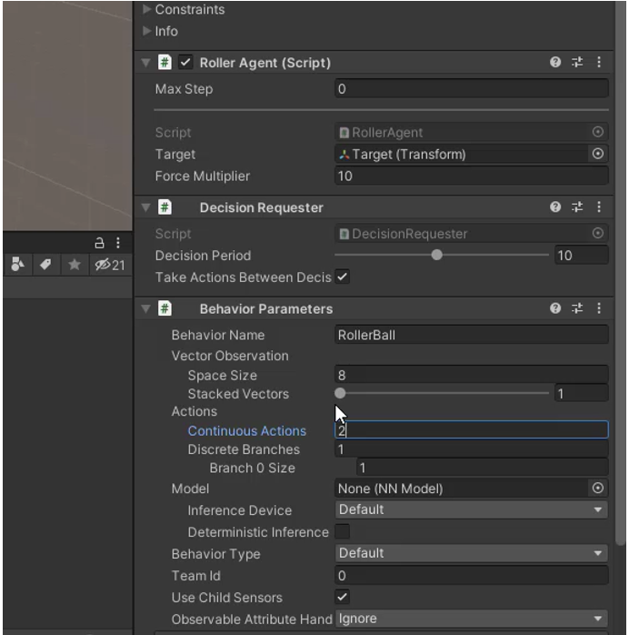
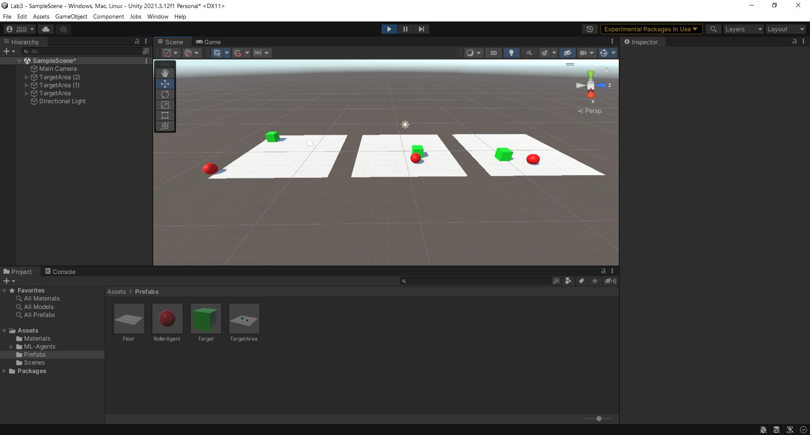
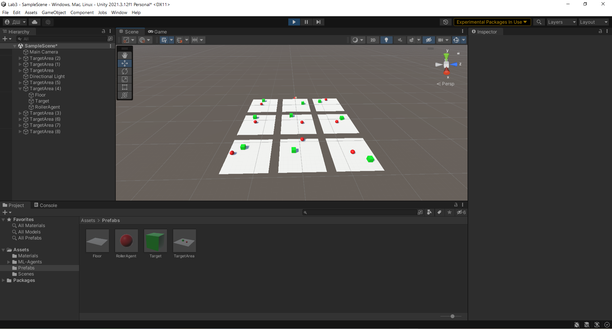
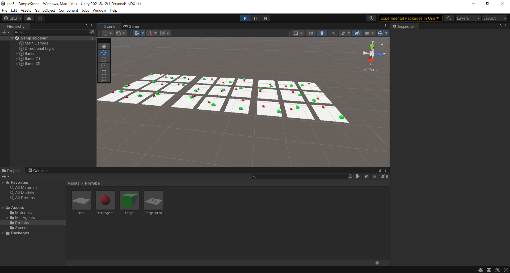
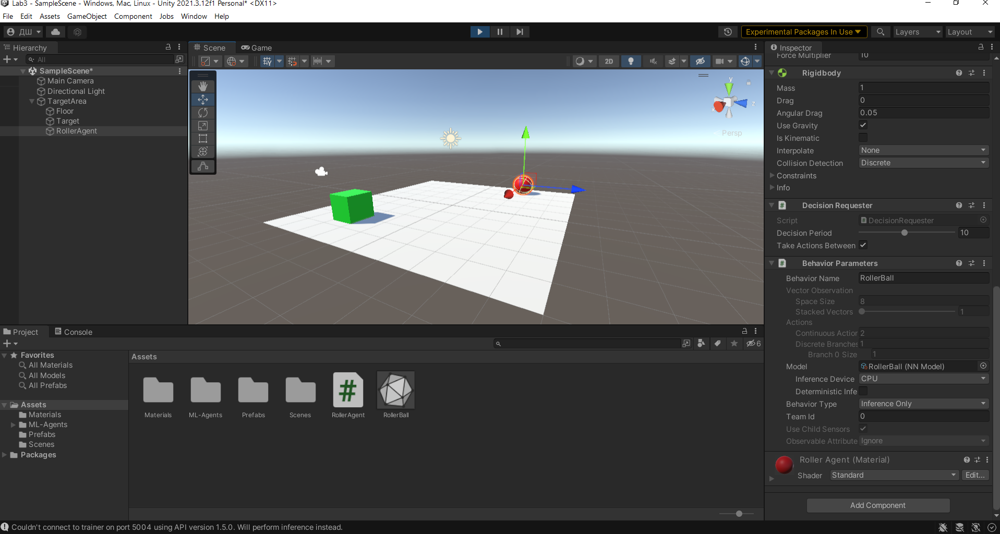

# АНАЛИЗ ДАННЫХ И ИСКУССТВЕННЫЙ ИНТЕЛЛЕКТ [in GameDev]
## ЛАБОРАТОРНАЯ РАБОТА #3. РАЗРАБОТКА СИСТЕМЫ МАШИННОГО ОБУЧЕНИЯ
Отчет по лабораторной работе #3 выполнил(а):
- Шмаков Данил Юрьевич
- РИ210911
Отметка о выполнении заданий (заполняется студентом):

| Задание | Выполнение | Баллы |
| ------ | ------ | ------ |
| Задание 1 | * | 60 |
| Задание 2 | * | 20 |
| Задание 3 | # | 20 |

знак "*" - задание выполнено; знак "#" - задание не выполнено;

Работу проверили:
- к.т.н., доцент Денисов Д.В.
- к.э.н., доцент Панов М.А.
- ст. преп., Фадеев В.О.

[](https://nodesource.com/products/nsolid)

[](https://travis-ci.org/joemccann/dillinger)

Структура отчета

- Данные о работе: название работы, фио, группа, выполненные задания.
- Цель работы.
- Постановка задачи
- Задание 1.
- Код реализации выполнения задания. Визуализация результатов выполнения (если применимо).
- Задание 2.
- Код реализации выполнения задания. Визуализация результатов выполнения (если применимо).
- Задание 3.
- Код реализации выполнения задания. Визуализация результатов выполнения (если применимо).
- Выводы.

## Цель работы
Познакомиться с программными средствами для создания системы машинного обучения и ее интеграции в Unity.

## Постановка задачи
В данной лабораторной работе мы создадим ML-агент и будем тренировать нейросеть, задача которой будет заключаться в управлении шаром. Задача шара заключается в том, чтобы оставаясь на плоскости находить кубик, смещающийся в заданном случайном диапазоне координат.

## Задание 1
### Реализовать систему машинного обучения в связке Python - Google-Sheets – Unity.
- Создаём новый проект Unity, с подключёнными к нему пакетами ML Agents и ML Agents Extensions
- Создаём и активируем новый ML-агент через Anaconda Prompt, а также скачиваем необходимые библиотеки
- Создаём на сцене в Unity плоскость, куб и сферу. Создаём C# скрипт-файл(RollerAgent.cs) и подключаем его к сфере.
- Добавляем сфере компоненты Rigidbody, Decision Requester, Behavior Parameters и настраиваем их.

- Добавляем файл конфигурации нейронной сети(rollerball_config.yaml)
- Запускаем обучение через Anaconda Prompt коммандой `mlagents-learn rollerball_config.yaml --run-id=RollerBall --force`
- Запускаем симуляцию.
- Пробуем добавить ещё несколько площадок для обучения(3, 9, 27)



- Запускаем команду `mlagents-learn rollerball_config.yaml --run-id=RollerBall --resume` и ждём пока модель обучится, я использовал 50 000 шагов.
- Получили модель(RollerBall.onnx).
- Проверяем её на одном экземпляре.

- Вывод: обучили модель шара, научив его двигатся в сторону куба.

## Задание 2
### Описание используемых при обучении программных средств
Файл 
```yaml
behaviors:
  RollerBall:
    trainer_type: ppo #Тип тренировки(proximal policy optimization)
    hyperparameters:
      batch_size: 10 #Количество опытов на каждой итерации градиентного спуска
      buffer_size: 100 #Количество опытов на каждой итерации до обновления модули
      learning_rate: 3.0e-4 #Начальная скорость обучения, влияет на изменения на каждом шаге
      beta: 5.0e-4 #Делает поведение модели более случайным
      epsilon: 0.2 #Показывает как быстро изменяется модель
      lambd: 0.99 #Влияет на стабильность обучения
      num_epoch: 3 #Количество эпох
      learning_rate_schedule: linear
    network_settings:
      normalize: false #Нормализация входных векторов
      hidden_units: 128 #Кол-во элементов в скрытых слоях
      num_layers: 2 #Кол-во скрытых слоёв
    reward_signals:
      extrinsic:
        gamma: 0.99 #Понижающий множитель для будущих наград
        strength: 1.0 #Увеличение награды при обучении
    max_steps: 500000 #Максимальное количество шагов
    time_horizon: 64 #Как много шагов будет сделано, прежде чем  будет добавлен в experience buffer
    summary_freq: 10000 #Количество шагов между выводами статистики
```


## Выводы

- Реализовали систему машинного обучения с помощью Python и Unity, обучили модель
- Описали используемыe при обучении программныe средства и входные параметры

| Plugin | README |
| ------ | ------ |
| Dropbox | [plugins/dropbox/README.md][PlDb] |
| GitHub | [plugins/github/README.md][PlGh] |
| Google Drive | [plugins/googledrive/README.md][PlGd] |
| OneDrive | [plugins/onedrive/README.md][PlOd] |
| Medium | [plugins/medium/README.md][PlMe] |
| Google Analytics | [plugins/googleanalytics/README.md][PlGa] |

## Powered by

**BigDigital Team: Denisov | Fadeev | Panov**
